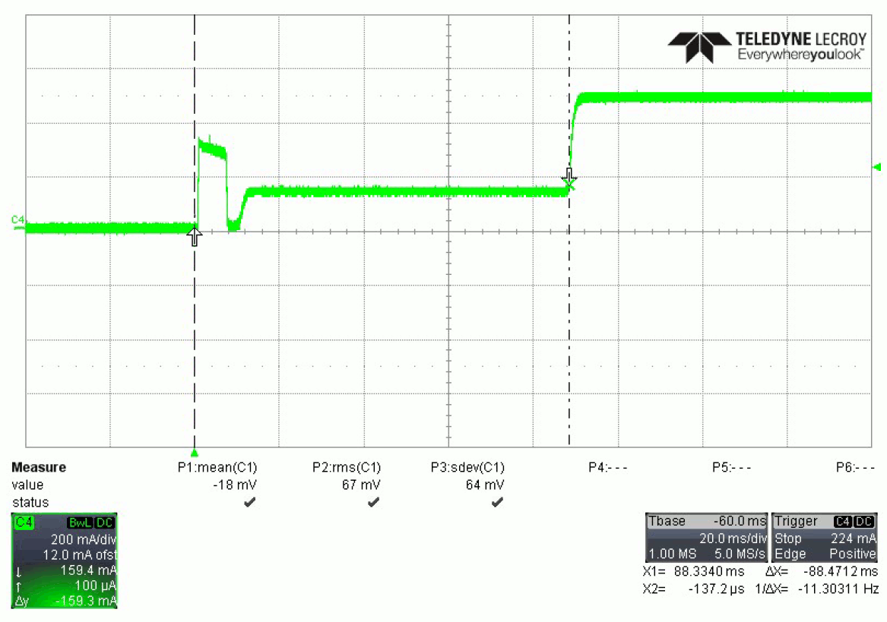

Power-on
--------

>   The prompt "RT-PoE5\>" indicates that the unit is ready for commands.

>   ”(revision dependent version string)”

>   RT-PoE5\>

 A.2 Error messages
----------------------

>   All error messages begin with the "!" exclamation mark.

| *Error Message*                       | *Description*                                                                                                                           |
|---------------------------------------|-----------------------------------------------------------------------------------------------------------------------------------------|
| ! Syntax error                        | There was syntax error in the previous command.                                                                                         |
| ! Reach PoE Tester...                 | There is an internal version error in this unit.                                                                                        |
| ! invalid port value                  | The value given with the port prefix was not valid.                                                                                     |
| ! invalid group value                 | The value given with the group prefix was not valid.                                                                                    |
| ! run calibration first               | If the power-on calibration was interrupted, and the set or class commands are used, this error message is generated.                   |
| ! invalid class value for dual mode   | The CLASS command argument for a port in dual signature mode is not 0 thru 5.                                                           |
| ! invalid class for single mode       | The CLASS command argument for a port in single signature mode is not 0 thru 8, or an ‘L” was specified.                                |
| ! Error: set limit is 2000mA          | The argument for the SET command is too large.                                                                                          |
| ! Error: set limit is 1000mA per pair | The argument for the SET command is too large.                                                                                          |
| ! Error: pwr limit is 100W            | The argument for the PWR command is too large.                                                                                          |
| ! Error: pwr limit is 50W per pair    | The argument for the PWR command is too large.                                                                                          |
| ! unsupported baud rate               | Baud rate argument is invalid                                                                                                           |
| ! invalid arguments                   | Command argument(s) are invalid                                                                                                         |
| (other messages)                      | There are other messages that begin with an exclamation point that are internal errors. If these appear, the unit needs to be repaired. |

 A.3 Inrush Example Waveform
-------------------------------

>   The example waveform below shows the current waveform for the main pair on a
>   single port during the inrush period. The voltage is supplied by a standard
>   bulk power supply set to 50v. The commands used for the setup are:

>   p1 set 500,0  
>   p1 conn 1,0

>   The initial rising edge occurs when the voltage goes above about 38v, and
>   this pulse is the bulk capacitor charging. Then the load transitions to the
>   100ma (approx.) minimum load for the duration of the inrush timer setting
>   ([INR](#_INR) command). When the inrush timer expires, the load goes to the
>   selected value of 500ma.

>   InrushWaveform
