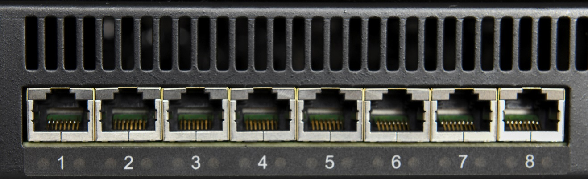
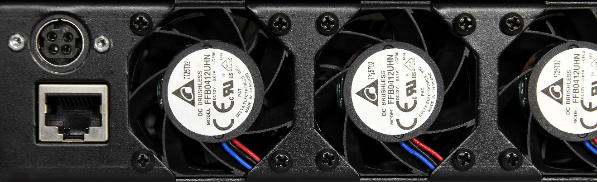

RJ-45 Ethernet Connectors
-------------------------

**Picture 2: Far left side of RT-PoE5 front panel**

There are 24 numbered UUT ports. The RJ connector should be cabled to the
corresponding PSE port using a standard Ethernet 1-1 jumper cable. When
enabled via software command, the data component of the port N (N=1,3,5,…)
will be connected to the data of port N+1 via Ethernet transformers and
relays. This is a straight-through connection, not a crossover.

Rear Connectors 
----------------

**Picture 3: Far left side of RT-PoE5 rear panel**

The left side of the rear of the unit is shown above. The power jack is a
power DIN 4 pin with lock type, KYCON KPPX-4. Pin 1,4 are 12VDC and pin 2,3
are GND. Below that is a console connector (RJ45, three-wire RS-232). See
the [Serial Console](#_Serial_Console) section for pinout.

Ethernet Power Selection 
-------------------------

There are no jumpers required to set which conductors provide power. The
unit contains two separate power paths for pairs 1,2 / 3,6 and 4,5 / 7,8.
These have the standard full wave bridge, so any polarity is accepted. The
voltage measurement function handles either polarity and can be used to
validate the expected polarity of the PSE port.

Note that this manual follows the industry standard terminology of referring
to a power pair (four wires) as a “pair”. The wire-to-pair mapping is:

| **Power Pair** | **Physical Wires** |
|----------------|--------------------|
| Main           | 1, 2 and 3, 6      |
| Alt            | 4, 5 and 7, 8      |

Note that the “Cisco” standard 1,2 = negative and 3,6 = positive is reported
as a positive voltage (main pair). Alt pairs with 4,5 = positive, and 7,8 =
negative is reported as a positive voltage.
