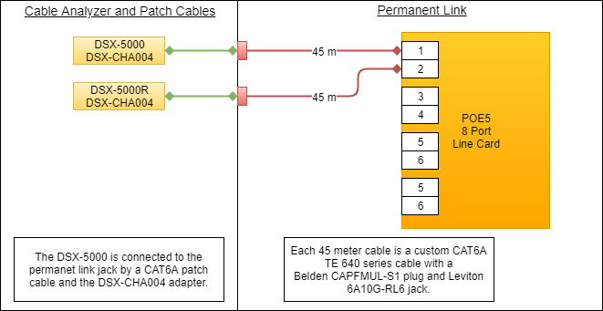

Ethernet Cables
===============

>   The performance of a CAT6A rated link is dependent on the cabling,
>   connectors, mated connections and hardware components that make up the link.

>   The PoE5 data path passes 10GBASE-T traffic from each test port to the
>   adjacent test port (ports 1-2, 3-4, etc.). The data path connections are
>   made through magnetics and signal relays for compatibility with Phy-based
>   cable diagnostics. When passing 10GBASE-T traffic through the PoE5 data
>   path, it is important to consider the type of cable, plugs and jacks used as
>   part of that link.

>   The PoE5 data paths are all tested to the TIA CAT6A permanent link test
>   limit using the DSX-5000 and the DSX-PLA004 permanent link adapters as shown
>   in Figure 1 below. The permanent link consists of two 40-meter CAT6A cables.
>   Each 40-meter length of cable consists of a plug mated to the test port, and
>   a jack mated to the DSX-PLA004 permanent link adapter. The cable and
>   connector combination shown in Figure 1 provided the best performance.

>   poe5-cableTest

>   Figure 1: PoE5 Permanent Link Test Setup
