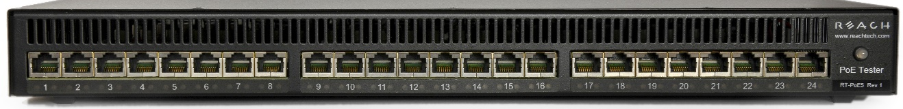

Overview
--------

Manufacturers of Ethernet Power Sourcing Equipment (PSE) such as Ethernet
Switches need to test PoE power functionality during manufacturing. Once a
unit is in manufacturing, it can be assumed that it has already been tested
for full compliance with the applicable IEEE 802.3 PoE standard. It is not
cost-effective, nor necessary, to perform full compliance testing at the
manufacturing stage. What is needed is a functional test that verifies the
software’s ability to detect and control power, and the basic connectors’
and magnetics’ ability to provide power and pass data.

The Reach RT-PoE tester family is designed for cost-effective, functional
production testing. It assumes that the PSE can be operated in a
“diagnostic” mode whereby the power control and detection functions of the
PSE can be individually tested. Data protocol features such as the Link
Layer Discovery Protocol (LLDP) are not supported so as to keep the cost of
the tester low. Most switches provide a way of bypassing LLDP to provide
full power to a particular port. LLDP is implemented in firmware: if the
unit can pass data under power it can pass LLDP packets, and so testing LLDP
functionality is not necessary for a production test.

The Reach Power-over-Ethernet Tester Model RT-PoE5 provides diagnostic
functional testing of 24 PSE ports compatible with IEEE Standards 802.3af,
802.3at, and 802.3bt, plus it will support data path speeds up to 10GBASE-T.
It can draw up to 1000mA per power pair (100W total over four pairs) while
passing 10Gb traffic. It provides high density with 24 Powered Device (PD)
loads in a 1U high chassis.

Each RT-PoE5 section has a “UUT” port (Unit Under Test). The UUT port is
connected to the PSE and acts as a PD load to that port. The UUT data path
is connected via power-isolating magnetics to the adjacent UUT port (1 to 2,
3 to 4, 5 to 6, etc.). In this way, an external data bit error tester or PSE
test functionality can be used to test data integrity while power load is
enabled.

Front Panel
-----------

**Picture 1: Front of RT-PoE5**

The front of the RT-PoE5.

Features
--------

- IEEE signature options: nominal, low, and over-spec capacitive.

- Classification 0 through 8, and autoclass (all nominal).

- Passes 10GbE traffic from each test port to the neighboring port, isolated
  from PD load (1-2, 3-4, etc.).

- Relay data path for compatibility with Phy-based cable diagnostics.

- Low cost compared to compliance-level PD emulators.

- Universal voltage (110/220) AC power supply.

- Serial RS-232 console control.

Dimensions
----------

The unit fits in a standard 19" rack using screw-on ears.

Case outside dimensions are:

16.665" deep 
17.30" wide (fits 19” rack; mounting ears provided) 
1.74" high

Electrical Characteristics
--------------------------

The RT-PoE5 is powered via a locking power DIN 4 pin connector and requires
a power supply capable of supplying 12VDC at 11.5 amps.

The unit comes with a worldwide universal AC input power supply brick. Its
characteristics are:

85-264VAC input, 90% efficient, 0°C to 40°C operation, IEC320/C14 input

Environmental
-------------

Operating temperature range is 0°C to 40°C. Storage range is -30°C to 70°C.

Humidity is 85% maximum, non-condensing

Warranty
--------

The RT-PoE5 is warranted by Reach Technology against manufacturing defects
for one year.

Operating Software
------------------

No Software license is required.

Calibration
-----------

The PoE5 is factory-calibrated to ensure the voltage and current
measurements are accurate. These are two-point calibrations, with the
results stored in FLASH on the processor doing the measurements.

Contact Reach for additional calibration information.