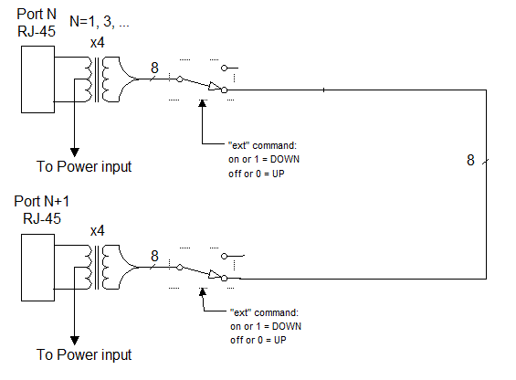
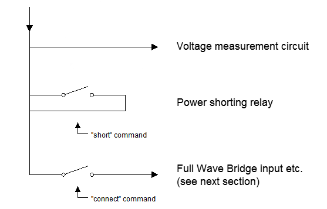
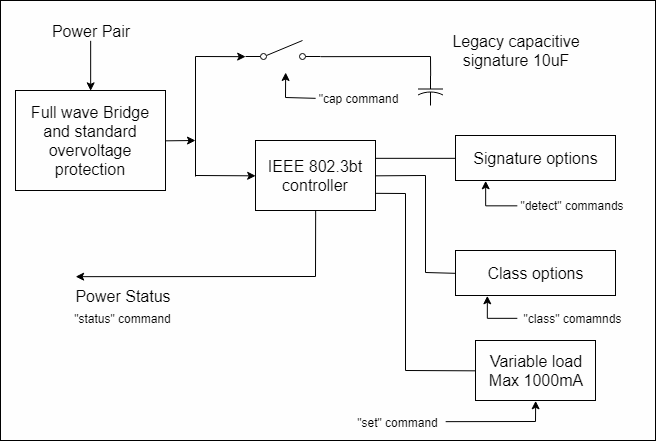
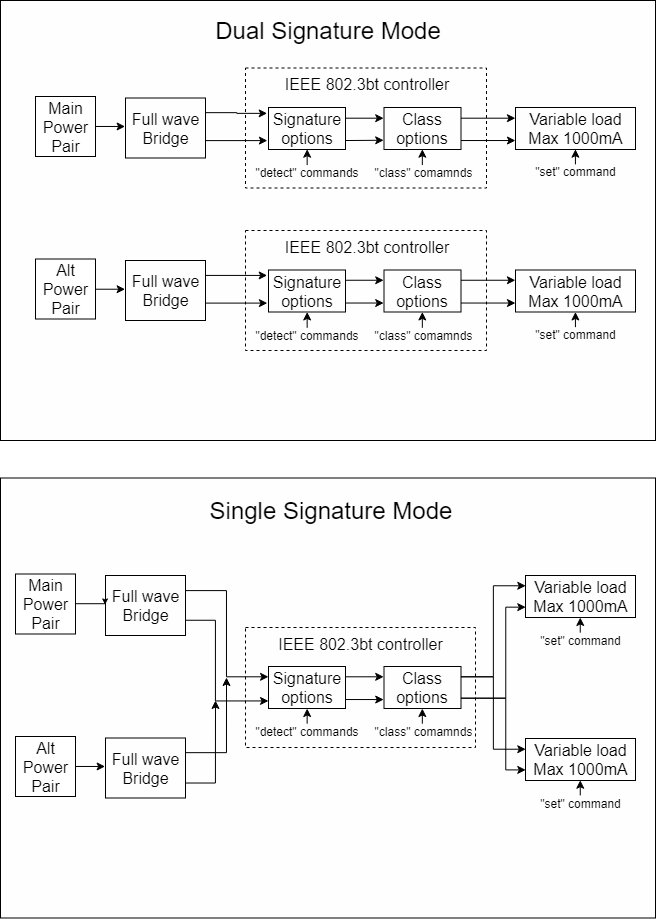

Data path
---------

>   The data path section allows the UUT port data to be in two states:
>   disconnected, or connected to the data of the next UUT port (default is
>   connected). This allows data to pass from port to port for testing.

>   DataPathGeneral

 Power input
---------------

>   Power Input (above); two instances, one for each power pair:

>   Each UUT port can have either power pair measured (reported voltage can be
>   positive or negative depending on polarity), shorted, or connected to the
>   Full Wave Bridge and subsequent load circuits. The power pairs can be
>   measured regardless of the state of the connect or short relay settings.

>   *WARNING – Sustained currents above 1 amp through the shorting relay may
>   damage the connector, PCB, relay, etc.*

 Signature, class, and load
------------------------------

>   One of these blocks per pair:

>   SignatureClassLoad

>   The IEEE 802.3bt controller (also known as the PD PoE controller) used is
>   the TI TPS2372.

>   The signature resistor options are nominal, or invalid (too low). This is
>   enough to validate the PSE’s ability to detect the physical IEEE signature.
>   A legacy capacitive load can be applied, which should cause the signature
>   detect to fail. This can also be used to simulate an AC load for AC
>   disconnect testing. The classification (Class) loads are standard. The
>   "power-good" status of the IEEE controller goes active once the load
>   capacitor (not shown) is charged and can be monitored via the “status”
>   command. This command reports the status of each of the two PoE PD
>   controllers. This will indicate which pairs are powered.

Dual/Single Signature Modes
---------------------------

>   Each port can operate in dual or single signature mode:

>   SingleDualSignature (1)

Fans
----

>   The fans run at a minimum speed whenever the tester is on and the loads are
>   disconnected. This is required to exhaust the internally-generated heat.

>   The fans will also run at a minimum speed when the total load on any test
>   port is 100mA or less (‘set’ value), or 4W or less (‘pwr’ value), and the
>   load is connected (“conn 1”).

>   The fans will run at full speed when any of the test ports have a total load
>   greater than 100mA or 4W, and the load is connected. After all ports are no
>   longer connected (e.g. reset command has been issued) the fans will run at
>   full speed until the nominal heatsink temperature has been reached, at which
>   point the fans return to the minimum speed.

RJ45 LEDs
---------

>   Each RJ45 connector has a yellow LED and a green LED. The yellow LED will be
>   lit when the port is processing a command from the control card/operator,
>   and will be off otherwise.

>   The green LED will be lit according to the following table when the
>   “power-good” status of the IEEE controllers go active. The “status” command
>   can also be used to report the “power-good” status of each PoE PD
>   controller.

| Green LED State       | Definition                          |
|-----------------------|-------------------------------------|
| Off                   | Both power-good signals inactive.   |
| On solid              | Both power-good signals active.     |
| One blink per second  | Main pair power-good signal active. |
| Two blinks per second | Alt pair power-good signal active.  |

>   Note that when the loads are connected and the fans are running, the PoE5
>   will send an internal command to the ports to check the heatsink
>   temperature. This will cause the yellow LED to blink on a regular basis, and
>   is normal operation.
